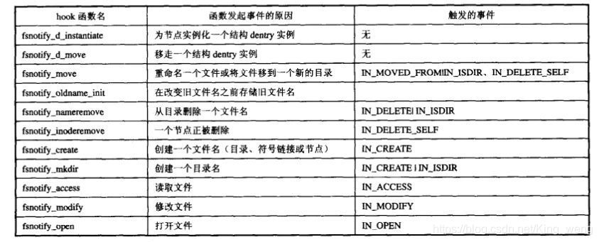

# Log Tracing

## Inotify

- `IN_ACCESS` ： 文件的读操作
- `IN_ATTRIB` ： 文件属性变化
- `IN_CLOSE_WRITE` ： 文件被关闭之前被写
- `IN_CLOSE_NOWRITE` ： 文件被关闭
- `IN_CREATE` ： 新建文件
- `IN_DELETE` ： 删除文件
- `IN_MODIFY` ： 修改文件
- `IN_MOVE_SELF` ： 被监控的文件或者目录被移动
- `IN_MOVED_FROM` ： 文件从被监控的目录中移出
- `IN_MOVED_TO` ： 文件从被监控的目录中移入
- `IN_OPEN` ： 文件被打开

## Ref

- <https://blog.csdn.net/King_weng/article/details/112246425>
